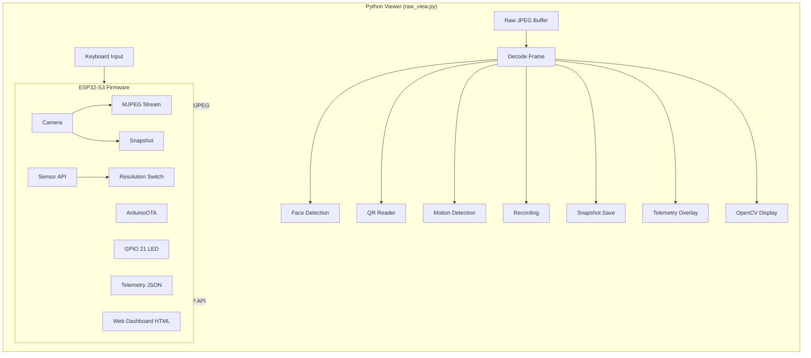
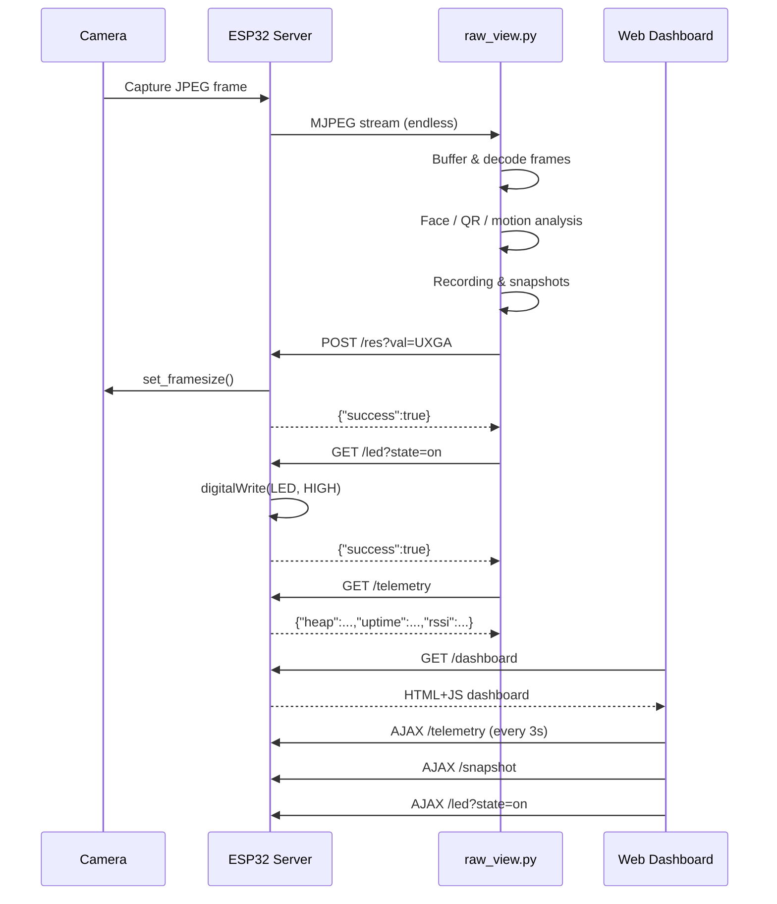

<div align="center">

# Seeed XIAO ESP32S3 Sense — Low Latency Streamer

**v1.0.0** — *Robust, low-latency video streaming from ESP32S3 Sense camera over WiFi*

[](https://platformio.org)
[](https://www.espressif.com)
[](https://python.org)
[](https://opencv.org)
[](https://opensource.org/licenses/MIT)
[](https://www.arduino.cc)

**Firmware and Python viewer for low‑latency MJPEG streaming from the Seeed XIAO ESP32S3 Sense, with custom buffering that avoids OpenCV timeouts.**

</div>

---

## Table of Contents

- [Overview](#overview)
- [Features](#features)
- [System Prerequisites](#system-prerequisites)
- [Installation & Setup](#installation--setup)
  - [1. Virtual Environment Setup](#1-virtual-environment-setup)
  - [2. Install Python Dependencies](#2-install-python-dependencies)
  - [3. Hardware Configuration (platformio.ini)](#3-hardware-configuration-platformioini)
  - [4. Configure WiFi and Upload Firmware](#4-configure-wifi-and-upload-firmware)
- [Running the Stream](#running-the-stream)
  - [5. Get the IP Address](#5-get-the-ip-address)
  - [6. Run the Python Viewer](#6-run-the-python-viewer)
- [How It Works](#how-it-works)
- [Troubleshooting](#troubleshooting)
- [Project Structure](#project-structure)

---

## Overview

This repository provides everything you need to turn a blank **Ubuntu** system into a working low‑latency video streaming setup for the **Seeed XIAO ESP32S3 Sense** camera.  
It includes:

- The **Arduino firmware** (uploaded via PlatformIO) that captures frames and serves an MJPEG stream over WiFi.
- A **custom Python viewer** (`raw_view.py`) that reliably displays the stream without the timeout errors often seen with OpenCV’s `VideoCapture`.

All steps are covered, from installing Python tools to uploading firmware to the board.

## Features

- 🚀 **Low-latency MJPEG streaming** over WiFi
- 📷 **Snapshot capture** — press `s` or use the dashboard
- 🎥 **Video recording** — toggle with `r`, saves to `recordings/`
- 🔄 **Resolution switching** — `1` (SVGA) / `2` (UXGA) keys or dashboard
- 🧑 **Face detection overlay** — toggle with `f`
- 📱 **QR code reader** — toggle with `z`, decodes in real time
- 🏃 **Motion detection** — toggle with `m`, highlights movement
- 💡 **LED control** — toggle with `l`, flash with `L`
- 📊 **Telemetry overlay** — toggle with `t` (heap, uptime, RSSI, temp, PSRAM)
- 🌐 **Web dashboard** — full control UI at `http://IP/dashboard`
- 📡 **OTA updates** — upload firmware over WiFi via ArduinoOTA
- 🔁 **Auto WiFi reconnect** — handles disconnects gracefully

## System Prerequisites

- **Ubuntu** (or any Debian‑based Linux with `apt`).
- **USB‑C data cable** – must support data transfer, not just charging.
- **Local WiFi network** (2.4 GHz).
- **Seeed XIAO ESP32S3 Sense** board.

## Installation & Setup

### 1. Virtual Environment Setup

Isolate project dependencies in a dedicated Python virtual environment.

```bash
# Install the venv tool
sudo apt update
sudo apt install python3-venv -y

# Create the virtual environment (we'll use ~/vir_esp32SENSEenv)
python3 -m venv ~/vir_esp32SENSEenv

# Activate it (do this every time you work on the project)
source ~/vir_esp32SENSEenv/bin/activate
```

Your terminal prompt should now begin with `(vir_esp32SENSEenv)`.

### 2. Install Python Dependencies

With the virtual environment active, install PlatformIO and the libraries needed by the viewer:

```bash
pip install platformio opencv-python numpy
```

### 3. Hardware Configuration (platformio.ini)

Initialize the PlatformIO project for the XIAO ESP32S3 board:

```bash
pio project init --board seeed_xiao_esp32s3
```

**CRITICAL:** The XIAO ESP32S3 Sense must have PSRAM enabled for the camera buffer.
Edit `platformio.ini` so it matches exactly:

```ini
[env:seeed_xiao_esp32s3]
platform = espressif32
board = seeed_xiao_esp32s3
framework = arduino
monitor_speed = 115200
upload_speed = 921600

; Enable 8MB PSRAM for the camera buffer
build_flags = 
    -DBOARD_HAS_PSRAM
    -DARDUINO_USB_MODE=1
    -DARDUINO_USB_CDC_ON_BOOT=1
```

### 4. Configure WiFi and Upload Firmware

Copy the config template and set your WiFi credentials:

```bash
cp src/config.example.h src/config.h
```

Edit `src/config.h` with your network details:

```cpp
const char* ssid = "YOUR_WIFI_SSID";
const char* password = "YOUR_WIFI_PASSWORD";
```

> `src/config.h` is in `.gitignore` — your credentials will never be committed.

Connect the ESP32S3 to your computer using a data‑capable USB‑C cable.

Compile and upload the firmware:

```bash
pio run -t upload
```

## Running the Stream

### 5. Get the IP Address

Once the upload finishes, open the serial monitor:

```bash
pio device monitor
```

Wait a few seconds until you see something like:

```
Stream Ready at: http://192.168.1.X/
```

Copy that IP address and press `Ctrl+C` to exit the monitor.

### 6. Run the Python Viewer

We use `raw_view.py` instead of OpenCV’s default `VideoCapture` because the built‑in network handler often crashes with “Timeout” errors when the WiFi latency fluctuates. Our script manually buffers raw JPEG bytes, completely avoiding that problem.

Set the IP address in the local config file (not tracked by git):

```bash
cp config.example.py config.py
```

Edit `config.py` and paste the IP address you copied:

```python
ESP32_IP = "http://192.168.1.X/"
```

Run the viewer:

```bash
python raw_view.py
```

**Keyboard Controls:**

| Key | Action |
|-----|--------|
| `q` | Quit |
| `s` | Save snapshot to `snapshots/` |
| `r` | Toggle video recording to `recordings/` |
| `1` | Set resolution to SVGA (800×600) |
| `2` | Set resolution to UXGA (1600×1200) |
| `f` | Toggle face detection |
| `z` | Toggle QR code reader |
| `m` | Toggle motion detection |
| `t` | Toggle telemetry overlay |
| `l` | Toggle built-in LED |
| `L` | Flash LED 5 times |
| `h` | Show help |

**Linux users:** If you see `QFontDatabase: Cannot find font directory`, just ignore it — it’s a harmless Qt warning and the video window will appear as usual.

### 7. (Optional) Use the Web Dashboard

Open a browser and navigate to:

```
http://IP/dashboard
```

The dashboard provides the same controls through a web UI: view the live stream, change resolution, toggle the LED, take snapshots, and monitor telemetry in real time.

### 8. (Optional) OTA Firmware Updates

Once the board is on WiFi, you can upload new firmware over the air instead of via USB:

```bash
pio run -t upload --upload-port IP
```

The board identifies itself as `xiao-esp32s3-cam` on the network.

## How It Works





**Why a custom viewer?**  
OpenCV’s `VideoCapture` relies on a tight internal timeout. Even small WiFi delays can cause it to throw an error and stop. Our approach:

1. Fetches raw bytes from the stream.
2. Buffers them manually.
3. Decodes only complete JPEG frames.
4. Displays them without ever hitting a fatal timeout.

## HTTP API Endpoints

The ESP32 exposes these REST endpoints:

| Endpoint | Method | Description |
|----------|--------|-------------|
| `/` | GET | MJPEG stream |
| `/snapshot` | GET | Single JPEG frame |
| `/res?val=SVGA|UXGA` | GET | Change camera resolution |
| `/led?state=on|off` | GET | Toggle built-in LED |
| `/flash?count=N` | GET | Flash LED N times (1-20) |
| `/telemetry` | GET | JSON: heap, uptime, RSSI, resolution, PSRAM, temperature |
| `/dashboard` | GET | Full web dashboard |

## Troubleshooting

| Problem | Likely Cause | Solution |
|---------|-------------|----------|
| Camera stream not working | PSRAM not enabled | Double‑check `platformio.ini` contains `-DBOARD_HAS_PSRAM` |
| Upload fails | Bad USB cable or wrong port | Use a data USB‑C cable; try a different port |
| No serial output after upload | Wrong baud rate | Make sure `monitor_speed = 115200` in `platformio.ini` |
| `Stream Ready` never appears | WiFi credentials wrong | Verify SSID and password; use 2.4 GHz network |
| Python viewer crashes with timeout | Using standard `VideoCapture` | Always use the provided `raw_view.py` |
| `QFontDatabase: Cannot find font directory` | Missing desktop fonts (Linux) | Harmless warning – video window still opens |
| OTA upload fails | Board not reachable | Ensure the board is on the same network and the IP is correct |
| Motion detection not working | Lighting changes too subtle | Adjust `motion_threshold` in `raw_view.py` |
| QR code not detected | Code too small or blurry | Hold QR code closer to the camera |

## Project Structure

```
.
├── platformio.ini           # Board & PSRAM configuration
├── config.example.py        # Template — copy to config.py & set IP
├── config.py                # Your local IP (gitignored)
├── raw_view.py              # Feature-rich Python viewer
├── src/
│   ├── config.example.h     # Template — copy to config.h & set WiFi
│   ├── config.h             # Your WiFi credentials (gitignored)
│   └── main.cpp             # ESP32 firmware entry point
├── include/
│   ├── camera_utils.h       # Camera init, resolution switching
│   ├── wifi_manager.h       # WiFi connect with auto-reconnect
│   ├── ota_manager.h        # Over-the-air updates
│   ├── web_server.h         # HTTP server + all API handlers
│   └── dashboard_html.h     # Embedded web dashboard HTML
├── recordings/              # Captured video storage
├── snapshots/               # Captured image storage
├── lib/                     # Private libraries
├── test/                    # PlatformIO test runner
└── README.md                # This documentation
```

<div align="center">
Built with ❤️ for reliable ESP32 video streaming
Contributions and improvements welcome!
</div>
