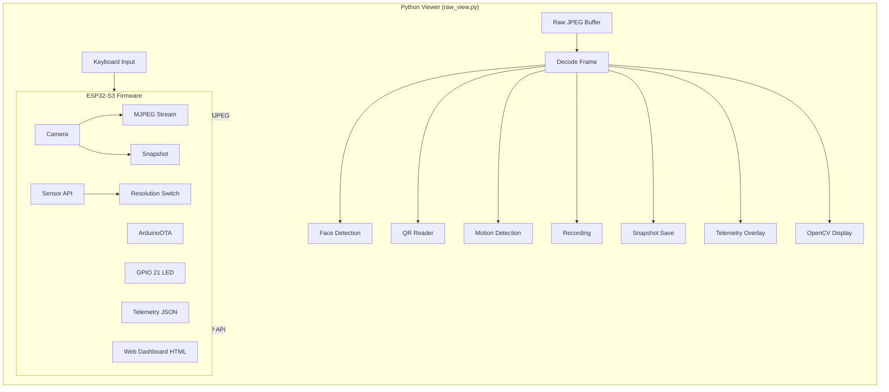
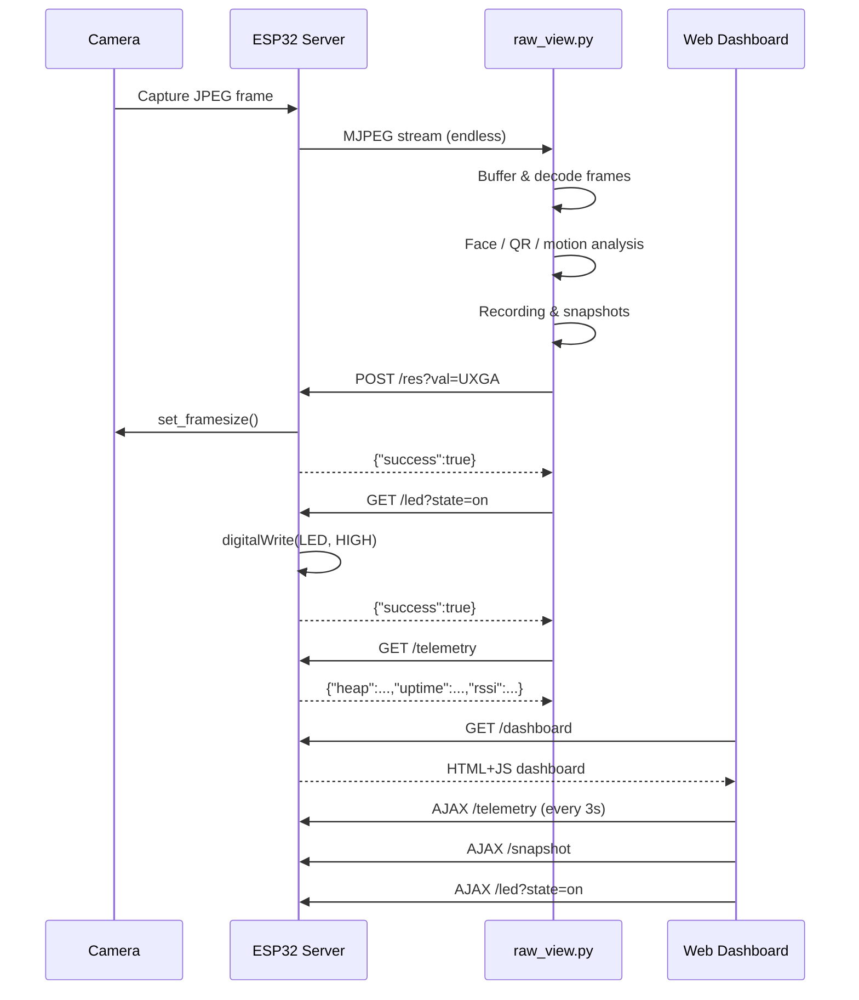
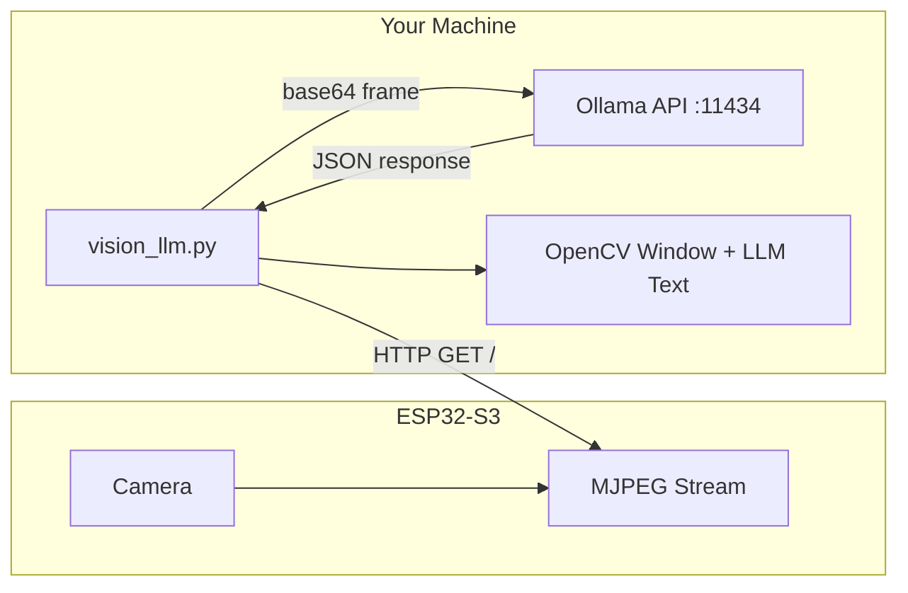

<div align="center">

# Seeed XIAO ESP32S3 Sense — Edge Intelligence Platform

**v2.0.0** — *Edge intelligence platform: streaming, Vision LLM, semantic search, YOLO gatekeeper, adaptive rate controller, scene classification, activity timeline, object counting, smart alerts, motion heatmap*

[](https://platformio.org)
[](https://www.espressif.com)
[](https://python.org)
[](https://opencv.org)
[](https://opensource.org/licenses/MIT)
[](https://www.arduino.cc)
[](https://fastapi.tiangolo.com)
[](https://ollama.ai)

**Firmware and Python suite for low‑latency MJPEG streaming from the Seeed XIAO ESP32S3 Sense, with AI-powered features.**

</div>

---

## Table of Contents

- [Overview](#overview)
- [Features](#features)
- [System Prerequisites](#system-prerequisites)
- [Installation & Setup](#installation--setup)
  - [1. Virtual Environment Setup](#1-virtual-environment-setup)
  - [2. Install Python Dependencies](#2-install-python-dependencies)
  - [3. Hardware Configuration (platformio.ini)](#3-hardware-configuration-platformioini)
  - [4. Configure WiFi and Upload Firmware](#4-configure-wifi-and-upload-firmware)
- [Running the Stream](#running-the-stream)
  - [5. Get the IP Address](#5-get-the-ip-address)
  - [6. Run the Python Viewer](#6-run-the-python-viewer)
  - [7. Use the Web Dashboard](#7-optional-use-the-web-dashboard)
  - [8. OTA Firmware Updates](#8-optional-ota-firmware-updates)
  - [9. Vision LLM](#9-vision-llm)
  - [10. FastAPI Server (app.py)](#10-fastapi-server-apppy)
- [Boss Mode](#boss-mode)
- [How It Works](#how-it-works)
- [Troubleshooting](#troubleshooting)
- [Project Structure](#project-structure)

---

## Overview

This repository provides everything you need to turn a blank **Ubuntu** system into a full edge intelligence platform for the **Seeed XIAO ESP32S3 Sense** camera.  
It includes:

- **Arduino firmware** (uploaded via PlatformIO) that captures frames and serves an MJPEG stream over WiFi.
- **FastAPI server** (`app.py`) — web dashboard with Vision LLM, YOLO gatekeeper, semantic search, and adaptive rate control.
- **Standalone Python viewer** (`raw_view.py`) — feature-rich OpenCV viewer with face/QR/motion detection, recording, and HUD.
- **Vision LLM CLI** (`vision_llm.py`) — stream frames to local Ollama vision models for real-time AI description.

## Features

- 🚀 **Low-latency MJPEG streaming** over WiFi
- 📷 **Snapshot capture** — press `s` or use the dashboard
- 🎥 **Video recording** — toggle with `r`, saves to `recordings/`
- 🔄 **Resolution switching** — `1` (SVGA) / `2` (UXGA) / `3` (VGA) / `4` (QVGA) / `5` (QQVGA)
- 🧑 **Face detection overlay** — toggle with `f`
- 📱 **QR code reader** — toggle with `z`, decodes in real time
- 🏃 **Motion detection** — toggle with `m`, highlights movement
- 💡 **LED control** — toggle with `l`, flash with `L`
- 📊 **Telemetry overlay** — toggle with `t` (heap, uptime, RSSI, temp, PSRAM, IP)
- 🌐 **Web dashboard** — full control UI at `http://localhost:8000`
- 📡 **OTA updates** — upload firmware over WiFi via ArduinoOTA
- 🔁 **Auto WiFi reconnect** — handles disconnects gracefully
- 🤖 **Vision LLM** — stream frames to local Ollama vision models (gemma3, llama3.2-vision, qwen2.5vl) for real-time AI description
- 🎨 **Modern HUD overlay** — drop shadows, translucent dark panels, and feature badges
- 🔄 **Stream rotation** — rotate the view 90°/180°/270° with `o`
- ✚ **Rule-of-thirds grid** — composition aid toggle with `g`
- 🎯 **Center crosshair** — alignment guide toggle with `c`
- ⏱ **Recording timer** — live `MM:SS` counter with red indicator
- 🖥 **Fullscreen mode** — `f` key on the web dashboard
- 🔍 **Semantic search** — natural-language video search via CLIP + ChromaDB
- 👁 **YOLO event gatekeeper** — real-time object detection triggering LLM analysis
- ⚡ **Adaptive rate controller** — auto-adjusts resolution & interval based on RSSI/latency
- ☠️ **Boss Mode** — detects cell phone distraction & roasts you via LLM + TTS
- 🏠 **Scene classification** — real-time scene analysis (indoor/outdoor/night/crowded) using CV heuristics, no ML dependency
- 📋 **Activity timeline** — tracks detection events with duration and creates a searchable timeline
- 🔢 **Object counting** — cumulative detection statistics with top-N class tracking
- 🔔 **Smart alert system** — configurable rules with per-class confidence thresholds and cooldown
- 📈 **Performance metrics history** — ring buffer of FPS/latency/queue depth for real-time charts
- 🌡️ **Motion heatmap** — accumulates motion regions with exponential decay into a visual heatmap
- ❤️ **Health endpoint** — `/ping` for connectivity checks
- 🩺 **Camera diagnostics** — detailed init failure reporting with automatic fallback
- 🔁 **Exponential backoff reconnect** — resilient stream recovery in viewer
- 🖼️ **Frame dimensions** — displayed in viewer window title
- 🧪 **Stream test script** — `stream_test.py` for quick connectivity check
- 🎛️ **CLI arguments** — override IP, port, and model via `--ip` command line argument
- 🧰 **Makefile** — `make viewer`, `make server`, `make vision`, `make test`, `make check` for quick commands
- ✅ **Setup validation** — `python src/check_deps.py` verifies all dependencies and configuration
- 🔄 **Camera flip/mirror** — toggle vertical flip and horizontal mirror from the dashboard
- 🏥 **Diagnostics endpoint** — `/diag` returns full chip info, firmware version, and system health
- 📊 **Aggregated dashboard** — `/dashboard-data` returns all telemetry in a single call
- 📊 **Analytics dashboard** — real-time FPS and latency charts via Chart.js
- 🔄 **Tabbed UI** — organized panels for Dashboard, Analytics, Events, Alerts, and Heatmap
- ⚙️ **Alert rules management** — enable/disable alert rules directly from the web UI

## System Prerequisites

- **Ubuntu** (or any Debian‑based Linux with `apt`).
- **USB‑C data cable** – must support data transfer, not just charging.
- **Local WiFi network** (2.4 GHz).
- **Seeed XIAO ESP32S3 Sense** board.

## Installation & Setup

### 1. Virtual Environment Setup

Isolate project dependencies in a dedicated Python virtual environment.

```bash
# Install the venv tool
sudo apt update
sudo apt install python3-venv -y

# Create the virtual environment (we'll use ~/vir_esp32SENSEenv)
python3 -m venv ~/vir_esp32SENSEenv

# Activate it (do this every time you work on the project)
source ~/vir_esp32SENSEenv/bin/activate
```

Your terminal prompt should now begin with `(vir_esp32SENSEenv)`.

### 2. Install Python Dependencies

With the virtual environment active, install PlatformIO and the libraries needed by the viewer/server:

```bash
# Install from requirements.txt (recommended)
pip install -r esp32-s3/requirements.txt

# Or install individually:
pip install platformio opencv-python numpy fastapi uvicorn requests
# Optional — for event gatekeeper:
pip install ultralytics
# Optional — for semantic search:
pip install chromadb sentence-transformers torch
# Required for Boss Mode TTS:
sudo apt install espeak -y
```

### 3. Hardware Configuration (platformio.ini)

Initialize the PlatformIO project for the XIAO ESP32S3 board:

```bash
pio project init --board seeed_xiao_esp32s3
```

**CRITICAL:** The XIAO ESP32S3 Sense must have PSRAM enabled for the camera buffer.
Edit `platformio.ini` so it matches exactly:

```ini
[env:seeed_xiao_esp32s3]
platform = espressif32
board = seeed_xiao_esp32s3
framework = arduino
monitor_speed = 115200
upload_speed = 921600

; Enable 8MB PSRAM for the camera buffer
build_flags = 
    -DBOARD_HAS_PSRAM
    -DARDUINO_USB_MODE=1
    -DARDUINO_USB_CDC_ON_BOOT=1
```

### 4. Configure WiFi and Upload Firmware

Copy the config template and set your WiFi credentials:

```bash
cp src/config.example.h src/config.h
```

Edit `src/config.h` with your network details:

```cpp
const char* ssid = "YOUR_WIFI_SSID";
const char* password = "YOUR_WIFI_PASSWORD";
```

> `src/config.h` is in `.gitignore` — your credentials will never be committed.

Connect the ESP32S3 to your computer using a data‑capable USB‑C cable.

Compile and upload the firmware:

```bash
pio run -t upload
```

## Running the Stream

### 5. Get the IP Address

Once the upload finishes, open the serial monitor:

```bash
pio device monitor
```

Wait a few seconds until you see something like:

```
Stream Ready at: http://192.168.1.X/
```

Copy that IP address and press `Ctrl+C` to exit the monitor.

### 6. Run the Python Viewer

We use `raw_view.py` instead of OpenCV’s default `VideoCapture` because the built‑in network handler often crashes with “Timeout” errors when the WiFi latency fluctuates. Our script manually buffers raw JPEG bytes, completely avoiding that problem.

Set the IP address in the local config file (not tracked by git):

```bash
cp config.example.py config.py
```

Edit `config.py` and paste the IP address you copied:

```python
ESP32_IP = "http://192.168.1.X/"
```

Run the viewer:

```bash
python raw_view.py
# Or override the IP via command line:
python raw_view.py --ip http://192.168.1.X/
```

**Keyboard Controls:**

| Key | Action |
|-----|--------|
| `q` | Quit |
| `s` | Save snapshot to `snapshots/` |
| `r` | Toggle video recording to `recordings/` |
| `1` | Set resolution to SVGA (800×600) |
| `2` | Set resolution to UXGA (1600×1200) |
| `3` | Set resolution to VGA (640×480) |
| `4` | Set resolution to QVGA (320×240) |
| `5` | Set resolution to QQVGA (160×120) |
| `f` | Toggle face detection |
| `z` | Toggle QR code reader |
| `m` | Toggle motion detection |
| `t` | Toggle telemetry overlay |
| `o` | Rotate stream 90° CW (cycles 0→90→180→270→0) |
| `g` | Toggle rule-of-thirds grid overlay |
| `c` | Toggle center crosshair |
| `l` | Toggle built-in LED |
| `L` | Flash LED 5 times |
| `h` | Show help |

**Linux users:** If you see `QFontDatabase: Cannot find font directory`, just ignore it — it’s a harmless Qt warning and the video window will appear as usual.

### 7. (Optional) Use the Web Dashboard

Open a browser and navigate to:

```
http://IP/dashboard
```

The dashboard provides the same controls through a polished web UI: view the live stream, change resolution, toggle the LED, take snapshots, rotate the stream, toggle fullscreen, and monitor telemetry in real time.

**Web Dashboard keyboard shortcuts:**

| Key | Action |
|-----|--------|
| `s` | Take snapshot |
| `r` | Rotate stream right |
| `0` | Reset rotation |
| `g` | Toggle grid overlay |
| `l` | LED on |
| `L` | Flash LED |
| `n` | Force AI analysis |
| `1`–`6` | Set resolution (QQVGA..UXGA) |
| `Esc` | Exit fullscreen |

### 8. (Optional) OTA Firmware Updates

Once the board is on WiFi, you can upload new firmware over the air instead of via USB:

```bash
pio run -t upload --upload-port IP
```

The board identifies itself as `xiao-esp32s3-cam` on the network.

### 9. Vision LLM

Stream the live camera feed to a local Ollama vision model for real-time AI descriptions. This is a separate tool that does not interfere with `raw_view.py`.

```bash
python vision_llm.py
```

You will be prompted to select a model and analysis interval. The video window shows:
- The live feed with the model's description overlaid on a dark info panel
- Auto-analysis at your chosen interval (or press `n` for manual)
- All text rendered with drop shadows for readability

**Prerequisites:** [Ollama](https://ollama.ai) running locally with at least one vision model pulled.

**Controls:**

| Key | Action |
|-----|--------|
| `q` | Quit |
| `a` | Toggle auto-analysis on/off |
| `n` | Analyze current frame now |
| `o` | Rotate stream 90° CW |
| `g` | Toggle rule-of-thirds grid overlay |
| `h` | Show controls in terminal |

### 10. Makefile Commands

A `Makefile` is provided for convenience:

```bash
make viewer        # Run OpenCV viewer (set ESP_IP=http://... to override)
make server        # Run FastAPI web server
make vision        # Run Vision LLM CLI
make test          # Run connectivity test
make upload        # Upload firmware via USB
make ota           # Upload firmware via OTA
make monitor       # Open serial monitor
```

### 11. FastAPI Server (app.py)

The FastAPI server provides a web dashboard with all AI features:

```bash
python src/app.py
# Or with custom options:
python src/app.py --ip http://192.168.1.X/ --port 8000 --model gemma3:latest
```

Open **http://localhost:8000** in your browser.

**Web dashboard features (tabbed UI):**
- Live MJPEG stream with grid overlay & rotation controls
- AI Vision panel with model selector, analysis interval, and real-time LLM results
- YOLO event log showing detected objects with confidence and severity
- Semantic search — search archived frames by natural language
- Adaptive controller status — shows current mode (normal/throttled/emergency)
- ESP32 controls — LED, 6-level resolution, telemetry, snapshots
- **Scene classification** — real-time indoor/outdoor/night/crowded detection
- **Analytics tab** — FPS & latency charts (Chart.js), object detection stats, activity timeline
- **Events tab** — full YOLO detection event log
- **Alerts tab** — configurable alert rules with enable/disable and history
- **Heatmap tab** — motion heatmap visualization with reset

**REST API Endpoints:**

| Endpoint | Method | Description |
|----------|--------|-------------|
| `/stream` | GET | MJPEG video stream |
| `/analysis` | GET | SSE stream of LLM analysis results |
| `/analyze-now` | POST | Force immediate LLM analysis |
| `/model` | POST | Set Ollama model |
| `/interval` | POST | Set analysis interval |
| `/events` | GET | YOLO detection events |
| `/search` | GET/POST | Semantic video search |
| `/system-status` | GET | Full system status with all subsystems |
| `/health` | GET | ESP32 + Ollama connectivity |
| `/telemetry` | GET | ESP32 telemetry proxy (includes IP, chip info) |
| `/led` | POST | Toggle LED |
| `/res` | POST | Set resolution (QQVGA/QVGA/VGA/CIF/SVGA/UXGA) |
| `/models` | GET | Available Ollama models |
| `/ping` | GET | Health check (status, IP, uptime) |
| `/scene` | GET | Current scene classification + history |
| `/timeline` | GET | Activity timeline entries and active events |
| `/stats` | GET | Object counting statistics and top classes |
| `/alerts` | GET | Alert rules, history, and stats |
| `/alerts/{idx}` | PUT/DELETE | Update or delete alert rule |
| `/metrics` | GET | Performance metrics time series |
| `/heatmap` | GET | Motion heatmap as base64 JPEG |
| `/heatmap/reset` | POST | Reset accumulated motion heatmap |
| `/flip` | POST | Toggle camera vflip or hmirror |
| `/diag` | GET | Full ESP32 diagnostics (chip, flash, PSRAM, SDK) |
| `/dashboard-data` | GET | Aggregated telemetry for frontend |

## Boss Mode

> ☠️ **When YOLO detects a cell phone in the frame for more than 5 seconds, the system roasts you.**

Boss Mode is a self-accountability feature built into `app.py`:

1. **YOLO gatekeeper** (`EventGatekeeper`) continuously tracks cell phone detections.
2. If a cell phone is in frame for **≥ 5 seconds**, it activates boss mode.
3. **Ollama** receives the frame with an aggressive system prompt:
   > *"You are a toxic, passive-aggressive boss. The user in this image is looking at their phone instead of coding. Roast them mercilessly in one short sentence based on what you see."*
4. The roast appears on the web dashboard as **huge red text** with a shake animation.
5. **espeak** yells the roast through your laptop speakers.

Boss mode auto-deactivates when the phone leaves the frame, with a 10-second cooldown between roasts.

**Requirements:**
```bash
sudo apt install espeak -y
```

## How It Works







**Why a custom viewer?**  
OpenCV’s `VideoCapture` relies on a tight internal timeout and single-threaded execution. Even small WiFi delays can cause it to throw an error or freeze the entire window. Our approach:

1. **Multi-threaded Capture:** A background thread handles all network I/O, preventing UI freezes.
2. **Self-Healing Buffer:** Automatically detects and discards corrupted JPEG data to prevent buffer jams.
3. **Real-time Sync:** Flushes the buffer queue to always display the absolute newest frame.
4. **Non-blocking Decode:** Only complete JPEG frames are decoded and passed to the main thread for display.

## HTTP API Endpoints

The ESP32 exposes these REST endpoints:

| Endpoint | Method | Description |
|----------|--------|-------------|
| `/` | GET | MJPEG stream |
| `/snapshot` | GET | Single JPEG frame |
| `/res?val=QQVGA|QVGA|VGA|CIF|SVGA|UXGA` | GET | Change camera resolution (6 levels) |
| `/led?state=on|off` | GET | Toggle built-in LED |
| `/flash?count=N` | GET | Flash LED N times (1-20) |
| `/telemetry` | GET | JSON: heap, uptime, RSSI, IP, resolution, PSRAM, total_PSRAM, temperature, chip_id, cpu_freq, camera_init_attempts, framesize |
| `/ping` | GET | Health check: status, uptime, IP |
| `/diag` | GET | Full chip diagnostics: model, cores, flash, PSRAM, SDK, firmware version |
| `/flip?mode=v|h` | GET | Toggle vertical flip (v) or horizontal mirror (h) |
| `/dashboard` | GET | Full web dashboard (embedded) |

## Troubleshooting

| Problem | Likely Cause | Solution |
|---------|-------------|----------|
| Camera stream not working | PSRAM not enabled | Double‑check `platformio.ini` contains `-DBOARD_HAS_PSRAM` |
| Upload fails | Bad USB cable or wrong port | Use a data USB‑C cable; try a different port |
| No serial output after upload | Wrong baud rate | Make sure `monitor_speed = 115200` in `platformio.ini` |
| `Stream Ready` never appears | WiFi credentials wrong | Verify SSID and password; use 2.4 GHz network |
| Python viewer crashes with timeout | Using standard `VideoCapture` | Always use the provided `raw_view.py` |
| `QFontDatabase: Cannot find font directory` | Missing desktop fonts (Linux) | Harmless warning – video window still opens |
| OTA upload fails | Board not reachable | Ensure the board is on the same network and the IP is correct |
| Motion detection not working | Lighting changes too subtle | Adjust `motion_threshold` in `raw_view.py` |
| QR code not detected | Code too small or blurry | Hold QR code closer to the camera |
| `vision_llm.py` cannot connect to Ollama | Ollama not running | Run `ollama serve` and verify with `ollama list` |
| Vision model slow | Large model on CPU | Use a smaller model like `llava:7b` or `minicpm-v`; increase analysis interval |
| Camera init fails repeatedly | PSRAM or power issue | Firmware auto-retries with VGA; check power supply |
| `raw_view.py` reconnects slowly | Network latency | Exponential backoff retries with up to 3 attempts |
| Need to test connectivity | Quick check | Run `python stream_test.py http://IP/` |

## Project Structure

```
.
├── Makefile                 # Common dev commands (`make viewer`, etc.)
├── platformio.ini           # Board & PSRAM configuration
├── README.md                # This documentation
├── __pycache__/             # Python bytecode cache (gitignored)
├── recordings/              # Captured video storage
├── snapshots/               # Captured image storage
├── chroma_db/               # ChromaDB persistent store (gitignored)
├── lib/                     # Private libraries
├── test/                    # PlatformIO test runner
├── testing/                 # Manual test documentation
├── include/                 # C++ firmware headers
│   ├── camera_utils.h       # Camera init, diagnostics, 6-level resolution
│   ├── wifi_manager.h       # WiFi connect with auto-reconnect
│   ├── ota_manager.h        # Over-the-air updates
│   ├── web_server.h         # HTTP server + all API handlers (incl. /ping)
│   └── dashboard_html.h     # Embedded web dashboard HTML
├── src/                     # Python host apps + firmware source
│   ├── app.py               # FastAPI server (Edge Intelligence Platform v2.0.0)
│   ├── raw_view.py          # Feature-rich Python viewer (with --ip CLI arg)
│   ├── vision_llm.py        # Live feed → Ollama vision LLM (with --ip CLI arg)
│   ├── stream_test.py       # Connectivity test script
│   ├── index.html           # Web dashboard with tabbed UI and charts
│   ├── config.py            # Your local IP (gitignored)
│   ├── config.example.py    # Template — copy to config.py & set IP
│   ├── config.h             # WiFi credentials (gitignored)
│   ├── config.example.h     # Template — copy to config.h & set WiFi
│   └── main.cpp             # ESP32 firmware entry point (v2.0.0 with diagnostics)
└── esp32-s3/                # Older project version (reference)
    ├── app.py               # FastAPI server (v1.0.0)
    ├── raw_view.py          # Legacy viewer
    ├── vision_llm.py        # Legacy vision client
    ├── stream_test.py       # Connectivity test
    ├── Makefile              # Common dev commands
    ├── .dockerignore         # Docker build exclusions
    ├── requirements.txt      # Python dependencies
    ├── index.html
    ├── platformio.ini
    ├── include/             # C++ headers (identical to root include/)
    └── src/                 # Firmware source
        ├── config.example.h
        └── main.cpp
```

<div align="center">
Built with ❤️ for reliable ESP32 video streaming
Contributions and improvements welcome!
</div>
